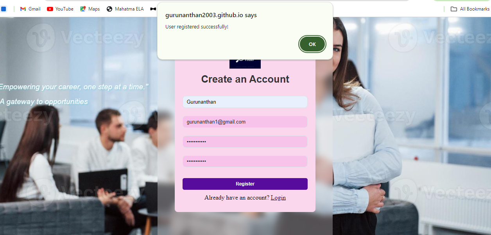
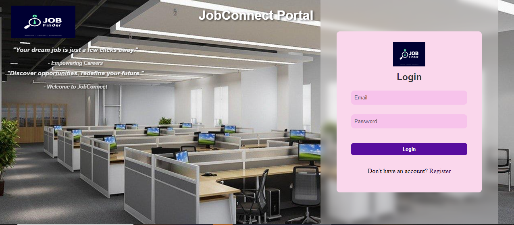
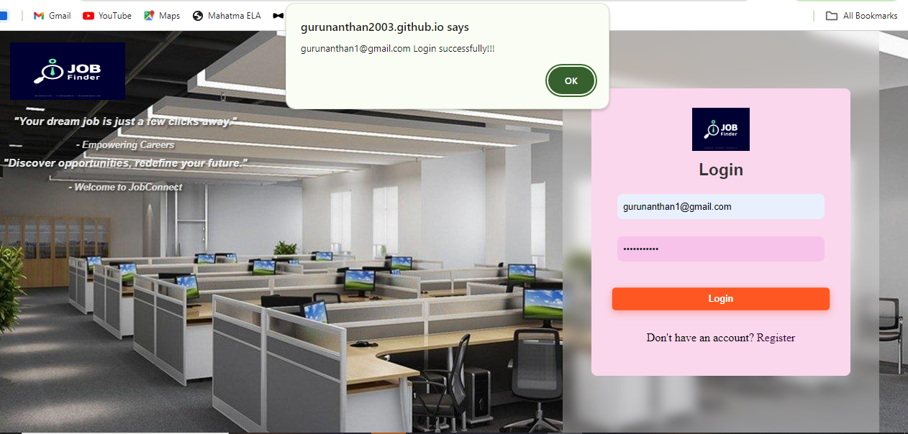
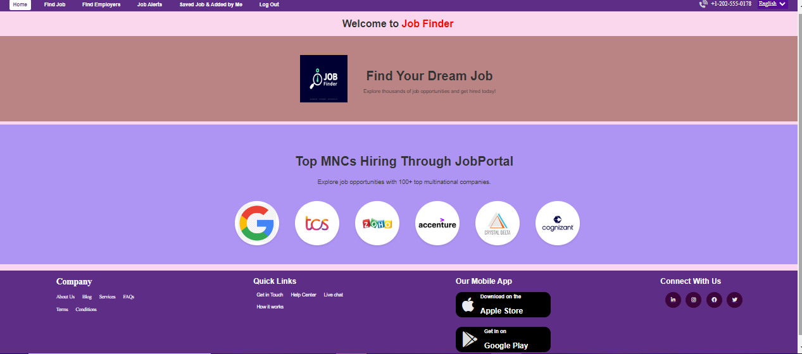
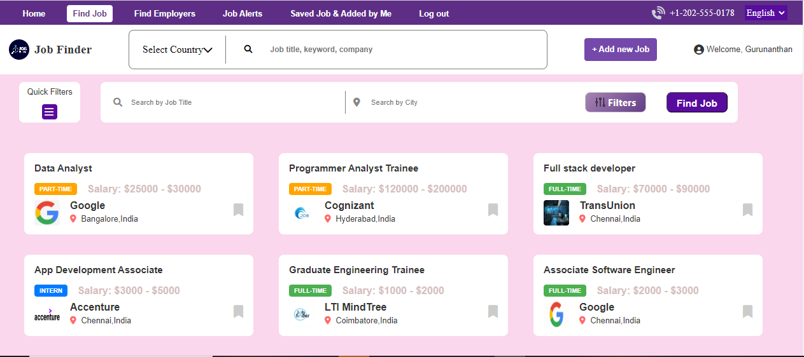
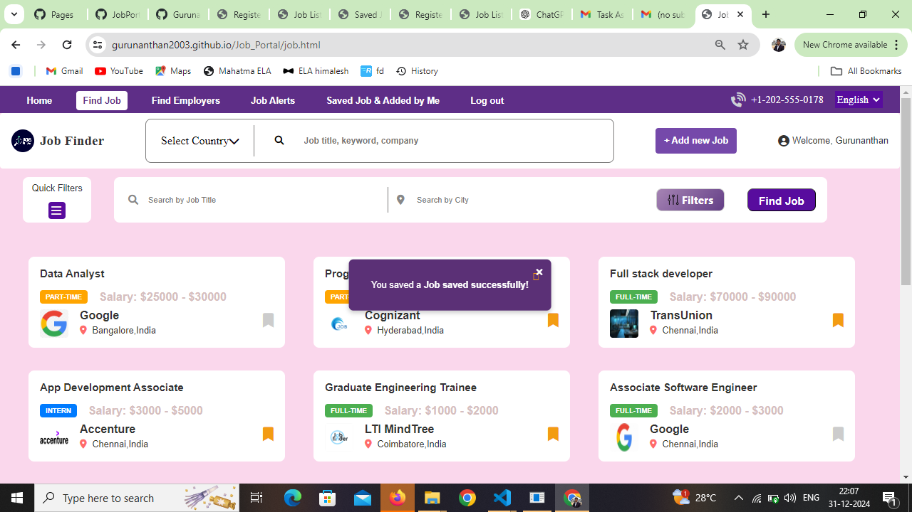
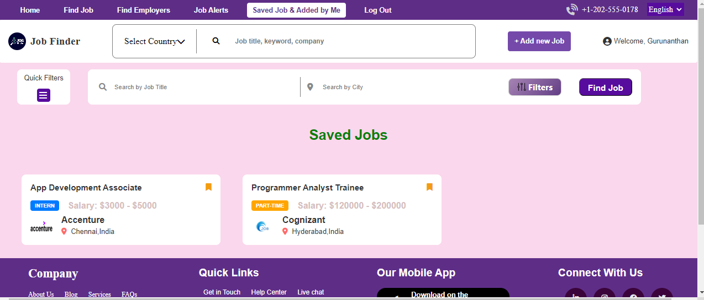
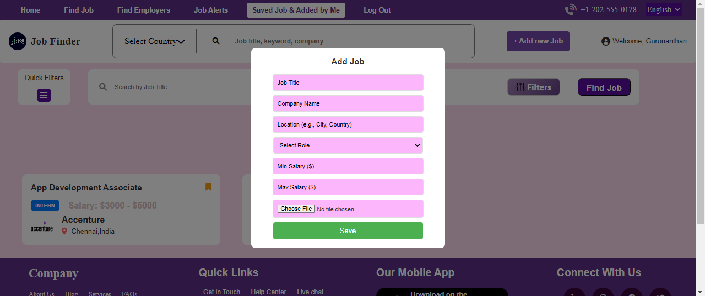

# Job Portal Application
 Job Portal  Link- https://gurunanthan2003.github.io/Job_Portal/
## **Overview**

The **Job Portal Application** is a comprehensive platform designed to connect job seekers with employers. Users can explore job listings and save their preferred opportunities.The platform utilizes Firebase for database storage and authentication to ensure a secure and efficient user experience. It is hosted on GitHub Pages for easy access.

## **Features**

- **User Authentication**: Secure login and registration for both job seekers and employers using **Firebase Authentication**.
- **Job Listings**: Browse available job listings with advanced search filters.
- **Advanced Filters**:
  - **Location-Based Filtering**: Find jobs in specific cities or regions.
  - **Industry and Role Filtering**: Search for jobs in preferred industries or roles.
  - **Salary Range Filtering**: Filter jobs based on salary expectations.
- **Profile Management**: Job seekers can create and update their profiles, stored securely in the **Firebase Database**.

## **Technologies Used**

### **Frontend**

- **HTML**
- **CSS**
- **JavaScript**
  
### **Backend**

- **Firebase Authentication**: Secure user login and registration.
- **Firebase Realtime Database**: Storing job listings,user profiles and Fetch them from the DB when required.
### **Application Hosted in GitHub pages**
You can access the job portal at the following link:
( https://gurunanthan2003.github.io/Job_Portal/)

## **Application Images**

### **Register Page**

### **Successfull Register**

### **Login Page**

### **Successfull Login **

### **Home Page**

### **Job Page**

### **Job Saved Notification**

### **Job Saved Page**

### **Find Employees Page**

### **Add New Jobs**

